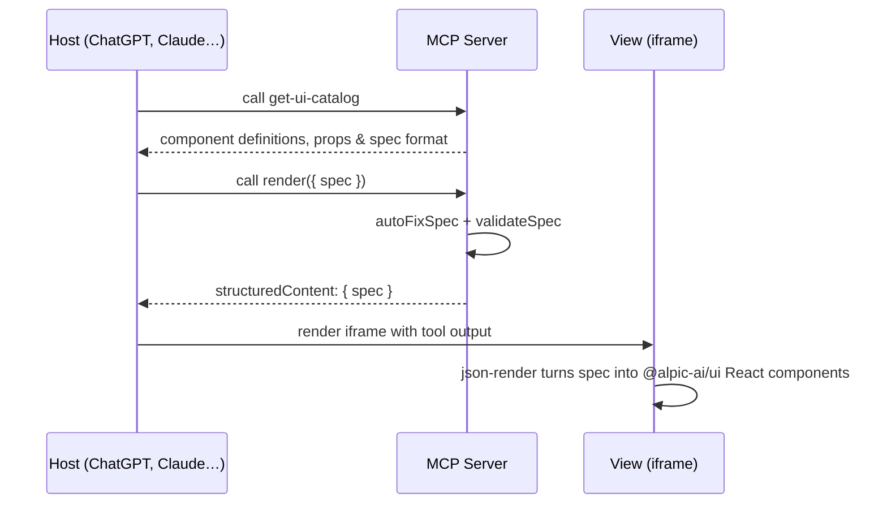

# Generative UI on Alpic

An MCP app built with Skybridge and [json-render](https://json-render.dev), rendering dynamic, model-generated UIs from a curated catalog of [`@alpic-ai/ui`](https://www.npmjs.com/package/@alpic-ai/ui) components — the Alpic design system.

## What This App Does

The app exposes two tools to the model:

1. **`get-ui-catalog`** — returns the full UI component catalog (props, slots, events, descriptions) as a single text payload. Call this first so the model knows what's available.
2. **`render`** — accepts a json-render spec, runs `autoFix` + structural validation, and pipes it to the matching view, where it gets rendered into real React components from `@alpic-ai/ui`.



### Why a custom catalog?

Instead of the default `@json-render/shadcn` catalog, this app ships its own catalog (`src/catalog.ts`) targeting `@alpic-ai/ui`. The component implementations live in `src/components.tsx` and map the json-render props to actual Alpic design system primitives (`Button`, `Card`, `Tabs`, `Input`, `Alert`, …) with the proper design tokens loaded from `@alpic-ai/ui/theme`.

The catalog is exposed verbosely (~few kilotokens) on each call so the LLM has the full schema in context. For production usage, curate it down to a smaller, domain-specific surface.

## Getting Started

### Prerequisites

- Node.js 24+
- pnpm (recommended), npm, yarn, or bun

### Install

```bash
pnpm install
```

### Run Locally

```bash
pnpm dev
```

This starts:

- Your MCP server at `http://localhost:3000/mcp`
- The Skybridge DevTools UI at `http://localhost:3000`

### Project Structure

```
src/
├── server.ts          # MCP server: get-ui-catalog + render tools
├── catalog.ts         # json-render component definitions for @alpic-ai/ui
├── components.tsx     # React implementations mapping spec → @alpic-ai/ui
├── helpers.ts         # Type-safe useToolInfo hook
├── index.css          # Tailwind v4 + @alpic-ai/ui/theme tokens
└── views/
    └── render.tsx     # Renderer widget (json-render Renderer)
```

### Customize the Catalog

To add or remove components:

1. Register the component definition in `src/catalog.ts` (Zod schema for props, slots, events, description, example).
2. Add a matching implementation in `src/components.tsx` that consumes `{ props, children, bindings, emit, on }` and returns a JSX tree built from `@alpic-ai/ui`.

Both files share the same key (e.g., `"Card"`), and json-render keeps them in sync via the catalog passed to `defineRegistry`.

## Testing your App

Test locally with the Skybridge DevTools UI on `http://localhost:3000` while running `pnpm dev`. To connect a remote MCP client (ChatGPT, Claude, …), expose your server with `pnpm dev:tunnel`.

## Deploy

Skybridge is infrastructure-agnostic. The fastest path is Alpic:

```bash
pnpm deploy
```

## Resources

- [Skybridge documentation](https://docs.skybridge.tech/)
- [json-render](https://json-render.dev/)
- [`@alpic-ai/ui`](https://www.npmjs.com/package/@alpic-ai/ui)
- [Apps SDK documentation](https://developers.openai.com/apps-sdk)
- [Alpic documentation](https://docs.alpic.ai/)
